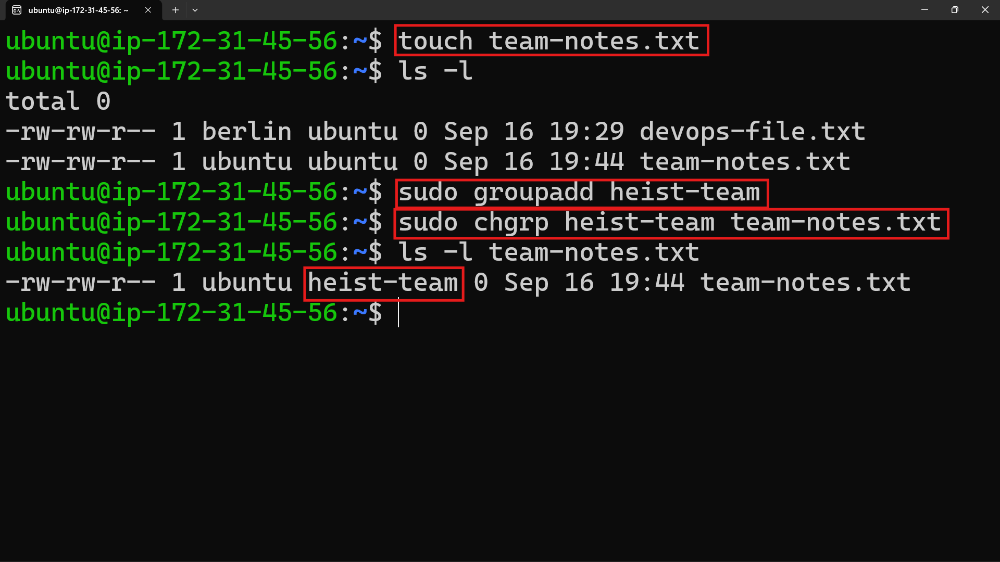
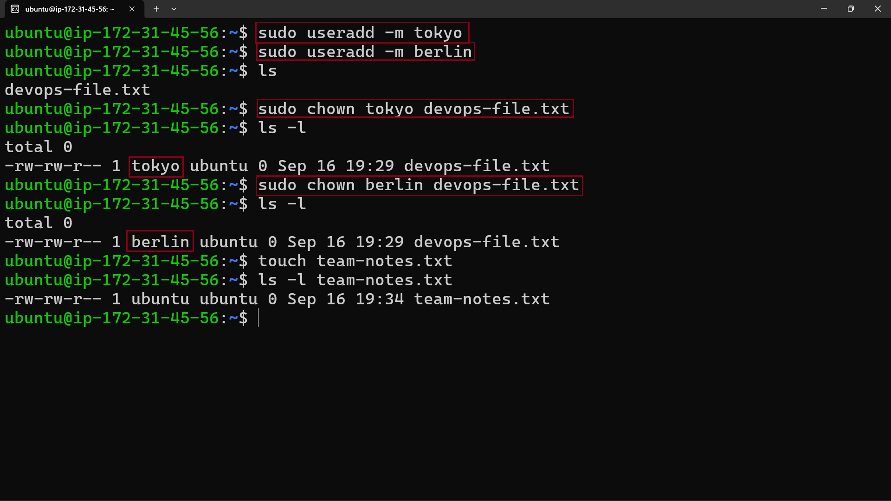
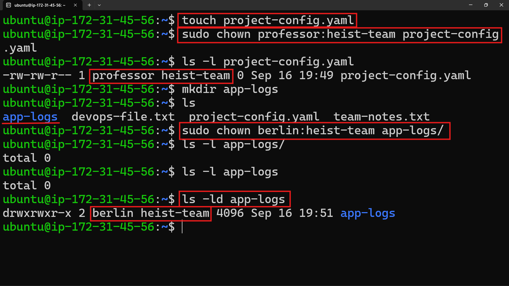
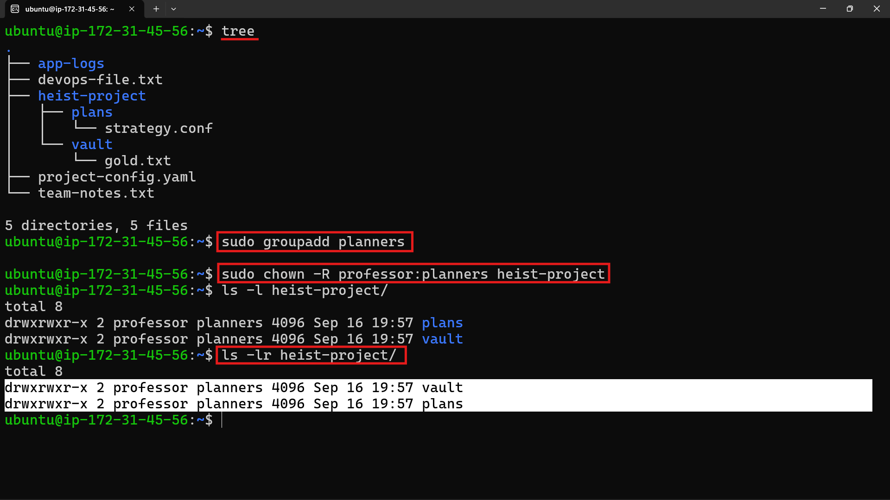
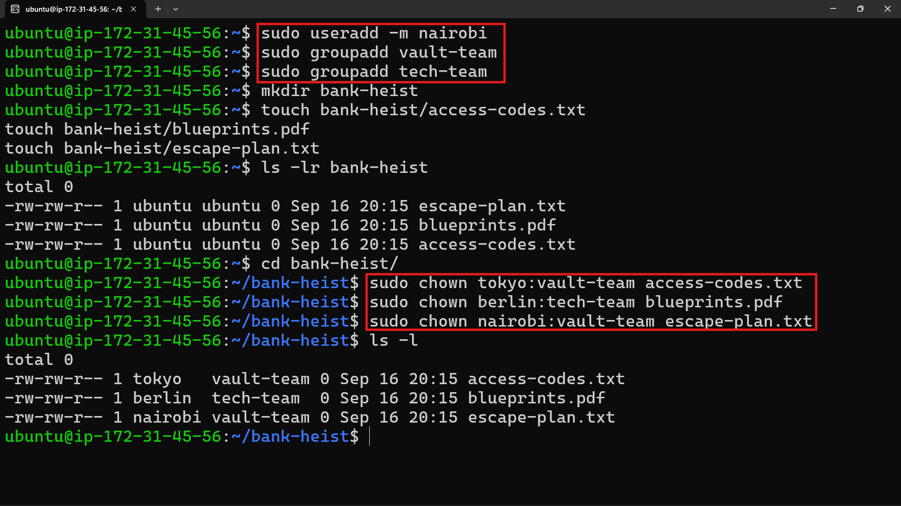

# Day 11 – Linux File Ownership

## 📌 Objective

Today I learned how Linux manages **file ownership and groups** using:

- `chown`
- `chgrp`
- Recursive ownership changes
- User and group management

---

## 🔍 Task 1 – Understanding File Ownership

First, I checked the ownership and permissions of files using:

```bash
ls -l
```

The output follows this structure:

```text
-rw-r--r-- 1 owner group size date filename
```

### Owner vs Group

- **Owner** → The user who owns the file.
- **Group** → A group of users associated with the file.

Example:

```text
tokyo:vault-team
```

Here, `tokyo` is the owner and `vault-team` is the group.

---

## 🔄 Task 2 – Using `chown`

Created a file:

```bash
touch devops-file.txt
```

Checked its ownership:

```bash
ls -l devops-file.txt
```

Created users:

```bash
sudo useradd tokyo
sudo useradd berlin
```

Changed the owner to `tokyo`:

```bash
sudo chown tokyo devops-file.txt
```

Then changed the owner to `berlin`:

```bash
sudo chown berlin devops-file.txt
```

Verified the changes using:

```bash
ls -l devops-file.txt
```

### 📷 Output




---

## 👥 Task 3 – Using `chgrp`

Created a file:

```bash
touch team-notes.txt
```

Created a group:

```bash
sudo groupadd heist-team
```

Changed the group ownership:

```bash
sudo chgrp heist-team team-notes.txt
```

Verified the change:

```bash
ls -l team-notes.txt
```

### 📷 Output




---

## 🔐 Task 4 – Change Owner and Group Together

Created a configuration file and directory:

```bash
touch project-config.yaml
mkdir app-logs
```

Changed both owner and group in a single command:

```bash
sudo chown professor:heist-team project-config.yaml
sudo chown berlin:heist-team app-logs
```

Verified:

```bash
ls -l project-config.yaml
ls -ld app-logs
```

### 📷 Output




---

## 🔁 Task 5 – Recursive Ownership

Created a directory structure:

```bash
mkdir -p heist-project/vault
mkdir -p heist-project/plans

touch heist-project/vault/gold.txt
touch heist-project/plans/strategy.conf
```

Created a group:

```bash
sudo groupadd planners
```

Changed ownership recursively:

```bash
sudo chown -R professor:planners heist-project/
```

The `-R` option applies the ownership change to the directory, subdirectories, and files inside it.

Verified using:

```bash
ls -lR heist-project/
```

### 📷 Output




---

## 🏦 Task 6 – Practice Challenge

Created users:

```bash
sudo useradd tokyo
sudo useradd berlin
sudo useradd nairobi
```

Created groups:

```bash
sudo groupadd vault-team
sudo groupadd tech-team
```

Created the project directory:

```bash
mkdir bank-heist
```

Created three files:

```bash
touch bank-heist/access-codes.txt
touch bank-heist/blueprints.pdf
touch bank-heist/escape-plan.txt
```

Assigned different ownerships:

```bash
sudo chown tokyo:vault-team bank-heist/access-codes.txt

sudo chown berlin:tech-team bank-heist/blueprints.pdf

sudo chown nairobi:vault-team bank-heist/escape-plan.txt
```

Verified the final ownership:

```bash
ls -l bank-heist/
```

### 📷 Output




---

## 🛠️ Key Commands

| Command | Purpose |
|---|---|
| `ls -l` | View file owner, group, and permissions |
| `chown user file` | Change file owner |
| `chgrp group file` | Change file group |
| `chown user:group file` | Change owner and group |
| `chown -R user:group directory/` | Recursively change ownership |
| `chown :group file` | Change only the group |
| `groupadd groupname` | Create a group |
| `useradd username` | Create a user |

---

## 💡 Key Takeaways

- Every Linux file has an **owner** and a **group**.
- `chown` is used to change ownership.
- `chgrp` is used to change group ownership.
- `chown owner:group` changes both at once.
- `chown -R` applies ownership changes recursively.
- Proper ownership is important for **security, deployments, shared directories, logs, containers, and CI/CD pipelines**.

---

## 🎯 Why This Matters in DevOps

File ownership is commonly involved in:

- Application deployments
- Shared team directories
- Docker containers
- Kubernetes volumes
- CI/CD pipelines
- Log management

Incorrect ownership can lead to **permission denied errors, application failures, and security issues**.

---

## 🚀 Day 11 Completed!

Another step forward in my **90 Days of DevOps** journey.

Today I practiced Linux users, groups, file ownership, `chown`, `chgrp`, and recursive ownership management.

**Consistency > Perfection.** 💪

#90DaysOfDevOps #DevOps #Linux #LearningInPublic
