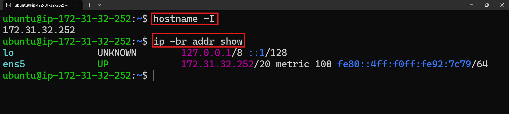
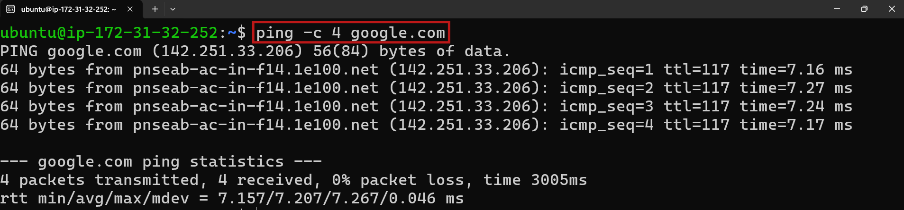
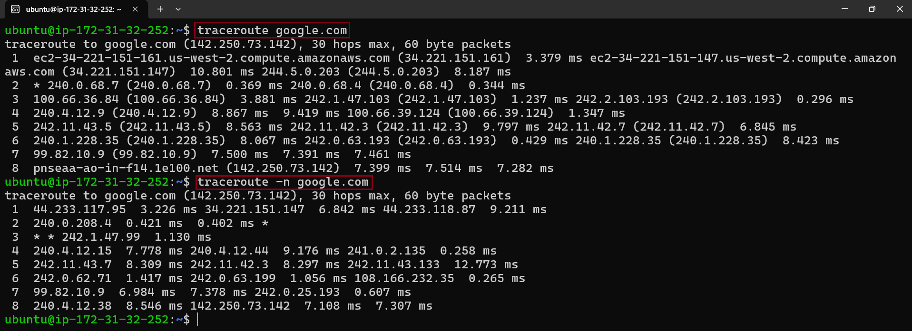
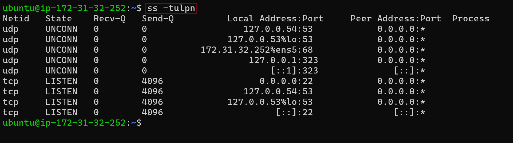
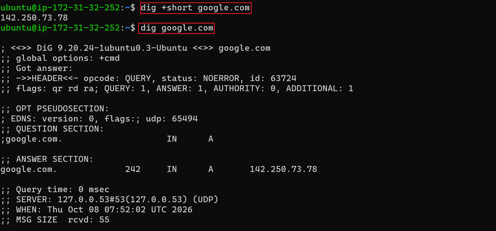
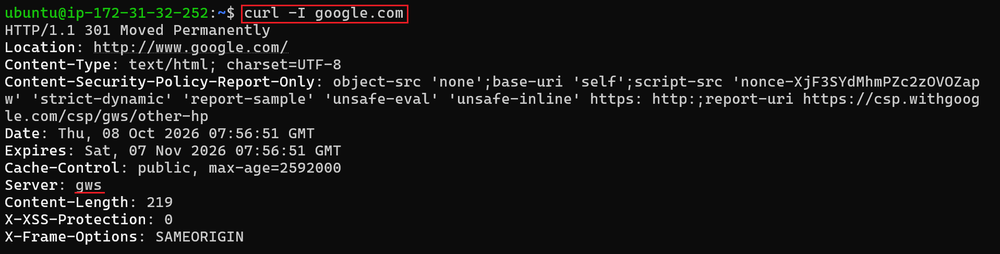
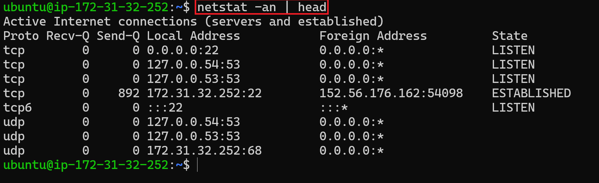
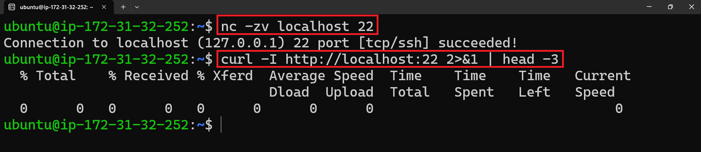

# Day 14 — Networking Fundamentals & Hands-on Checks

> **Goal:** Get comfortable with core networking concepts and the commands I’ll actually run during troubleshooting.  
> **Target host for this exercise:** `example.com` (with a few cross-checks against `google.com`)

---

## 1. Quick Concepts

### OSI vs TCP/IP — In My Own Words

| OSI Layer | What it does (1-liner) | TCP/IP Equivalent |
|---|---|---|
| **L7 — Application** | The protocols users and applications interact with, such as HTTP, DNS, and SSH. | **Application** |
| **L6 — Presentation** | Formats, encodes, compresses, or encrypts data, such as TLS, JSON, and gzip. | Application |
| **L5 — Session** | Establishes, manages, and ends communication sessions. | Application |
| **L4 — Transport** | Handles TCP/UDP communication, reliability, ordering, and port numbers. | **Transport** |
| **L3 — Network** | Handles IP addressing and routing between networks. | **Internet** |
| **L2 — Data Link** | Handles MAC addresses, switches, ARP, and frames on the local network. | **Link** |
| **L1 — Physical** | Handles cables, radio waves, signals, and physical network hardware. | Link |

**In my own words:**  
OSI is a 7-layer textbook model that helps me understand **where and how communication happens**. TCP/IP is the practical model used by the Internet. It combines OSI **L7–L5** into the **Application** layer and OSI **L2–L1** into the **Link** layer.

### Where Common Protocols Sit

- **IP** → L3 / Internet — delivers packets between hosts.
- **TCP / UDP** → L4 / Transport — TCP provides reliable, ordered delivery; UDP is connectionless with lower overhead.
- **DNS** → L7 / Application — commonly uses UDP/53 and can use TCP/53 when required.
- **HTTP / HTTPS** → L7 / Application — HTTPS is HTTP secured using TLS.

### One Real Example

```bash
curl https://example.com
```

A simple `curl` request can involve multiple layers:

```text
Application → HTTP/HTTPS
Transport   → TCP
Internet    → IP
Link        → Ethernet / Wi-Fi
```

## 2. Hands-on Checklist — Real Outputs

### a) Identity — `hostname -I` / `ip addr show`

**Image 01 — IP Address / Network Interfaces**



**Observation:**  
`hostname -I` shows the IP address assigned to the machine.

`ip addr show` provides detailed information about network interfaces, IP addresses, MAC addresses, and interface status.

A shorter command is:

```bash
ip -br addr show
```

`-br` means **brief**.

**In simple words:**  
`ip -br addr show` = **"Show me my network interfaces and their IP addresses in a short format."**

---

### b) Reachability — `ping <target>`

**Image 02 — Ping Test**



**Observation:**  
The test showed approximately **7 ms average latency** with **0% packet loss**, indicating that the network path to `google.com` was reachable and healthy during the test.

```bash
ping google.com
```

**What I learned:**

- **Latency** → How long a packet takes to travel and return.
- **Packet loss** → Packets that do not receive a reply.
- **0% packet loss** → All tested packets received a reply.

---

### c) Path — `traceroute <target>` / `tracepath`

**Image 03 — Traceroute / Tracepath**



**Observation:**  
`traceroute` / `tracepath` helps show the network path taken by packets between my machine and the destination.

The `-n` option means:

```text
Show IP addresses directly instead of resolving them to hostnames.
```

Example:

```bash
traceroute -n google.com
```

**Why it is useful:**  
It can help identify where a connection becomes slow or stops responding along the route.

---

### d) Ports — `ss -tulpn`

**Image 04 — Listening Ports**



**Observation:**  
`ss -tulpn` helps identify which TCP and UDP ports are listening, including services using those ports.

```bash
ss -tulpn
```

Useful options:

- `-t` → TCP
- `-u` → UDP
- `-l` → Listening
- `-p` → Show process/service
- `-n` → Show numbers instead of resolving names

**In simple words:**  
It helps me find **which services are listening on which ports**.

---

### e) Name Resolution — `dig <domain>`

**Image 05 — DNS Lookup**



**Observation:**  
`dig` stands for **Domain Information Groper**.

```bash
dig google.com
```

It asks the DNS system for information about `google.com`, such as its IP address.

**In simple words:**  
DNS converts a domain name such as:

```text
google.com
```

into an IP address that computers can use to communicate.

`dig` is useful for checking and troubleshooting DNS resolution.

---

### f) HTTP Check — `curl -I <url>`

**Image 06 — HTTP Headers**



**Observation:**  
The response showed:

```text
HTTP/1.1 301 Moved Permanently
```

This means the requested URL has been **permanently redirected** to another URL.

The response also showed:

```text
server: gws
```

This header indicates the server/service that generated the response.

Example:

```bash
curl -I https://google.com
```

**Why it is useful:**  
`curl -I` sends a request for the HTTP headers without downloading the complete page. It is useful for quickly checking:

- HTTP status codes
- Redirects
- Server information
- Content type
- Other response headers

---

### g) Connections Snapshot — `netstat -an | head`

**Image 07 — Network Connections**



**Observation:**  
This gives a quick overview of current network connections and listening ports.

```bash
netstat -an | head
```

**In simple words:**  
It provides a quick snapshot of network connections without resolving hostnames or service names.

> **Note:** `netstat` is considered a legacy tool on many modern Linux systems. `ss` is generally preferred for current troubleshooting.

---

## 3. Mini Task — Port Probe & Interpret

**Picked listener:** `sshd` on TCP port `22` (identified using `ss -tulpn`).

**Task Image**



### What I checked

```bash
ss -tulpn | grep :22
```

If SSH is listening, I can identify:

```text
TCP → Transport layer (L4)
Port 22 → SSH
sshd → SSH service
```

### Interpretation

If port `22` is listening, the SSH service is ready to accept connections on that interface.

However, a listening port alone does **not** guarantee that I can connect remotely. Firewall rules, security groups, routing, or other network controls can still block the connection.

---

## 4. Cheat Sheet — Keep This Handy

| Symptom | First Command | Layer / Area It Probes |
|---|---|---|
| **"Site won't load"** | `curl -vI https://site` | L7 → L4 → L3 |
| **"Server unreachable"** | `ping host` then `mtr host` | L3 |
| **"Name not resolving"** | `dig @8.8.8.8 host` | L7 — DNS |
| **"Connection refused"** | `ss -tulpn \| grep :PORT` | L4 |
| **"Which route is being used?"** | `traceroute -n host` | L3 |
| **"Which ports are listening?"** | `ss -tulpn` | L4 |
| **"What HTTP status is returned?"** | `curl -I https://site` | L7 |

---

## 5. Key Takeaways

- I learned how **OSI and TCP/IP models** map to each other.
- I understood where common protocols such as **IP, TCP, UDP, DNS, HTTP, and HTTPS** fit.
- I practiced checking **IP addresses and network interfaces**.
- I used `ping` to test **reachability and latency**.
- I used `traceroute` / `tracepath` to understand the **network path**.
- I used `ss` to check **listening ports and services**.
- I used `dig` to troubleshoot **DNS resolution**.
- I used `curl -I` to inspect **HTTP response headers and status codes**.
- I used `netstat` for a quick **connection snapshot**.
- I learned that troubleshooting is easier when I think **layer by layer**.

---

## 6. Final Reflection

The main lesson from Day 14 is that networking troubleshooting should not be guesswork.

When something is not working, I can check it step by step:

```text
IP / Interface
      ↓
Reachability
      ↓
Route
      ↓
Port
      ↓
DNS
      ↓
HTTP / Application
```

This gives me a structured way to identify **where the problem is** instead of randomly trying commands.
