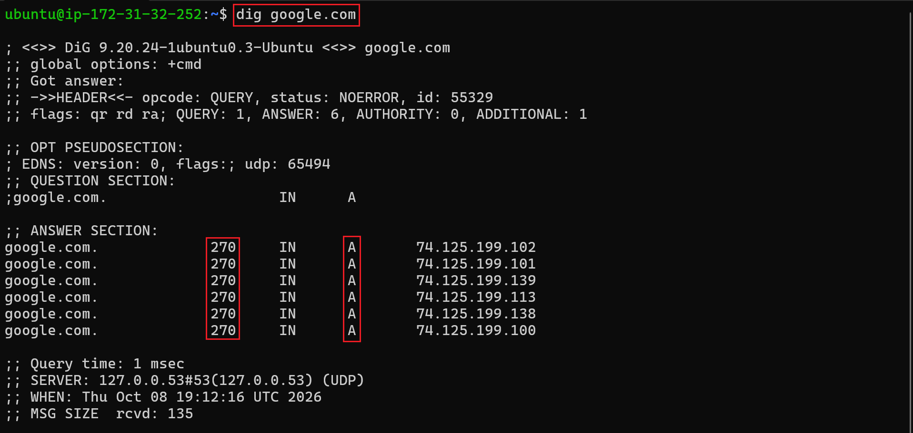
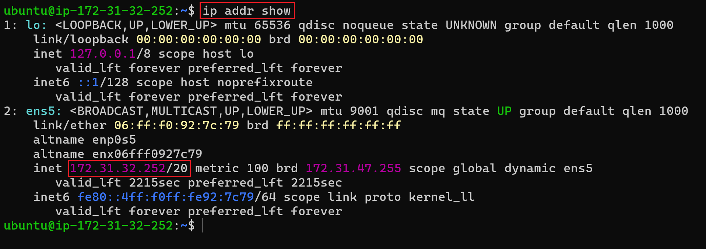
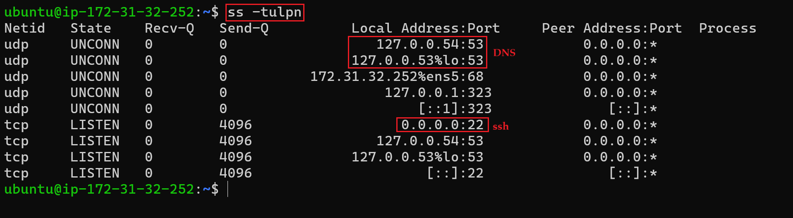

# Day 15 – Networking Concepts: DNS, IP, Subnets & Ports

> **Goal:** Understand the networking concepts and commands commonly used in DevOps troubleshooting.

---

## Objective

Today I learned the core networking concepts every DevOps engineer should understand:

- DNS resolution
- IPv4 addressing
- Public vs Private IPs
- CIDR and subnetting basics
- Common networking ports
- Service communication troubleshooting

---

# Task 1 – DNS: How Names Become IPs

## What happens when you type `google.com`?

1. The browser checks its DNS cache.
2. A DNS resolver looks for the domain's IP address.
3. DNS returns the IP address to the browser.
4. The browser connects to that IP and loads the website.

### DNS Record Types

| Record | Purpose |
| --- | --- |
| **A** | Maps a domain name to an IPv4 address. |
| **AAAA** | Maps a domain name to an IPv6 address. |
| **CNAME** | Creates an alias for another domain name. |
| **MX** | Specifies mail servers for a domain. |
| **NS** | Specifies the authoritative DNS servers for a domain. |

### 🔧 Command Used

```bash
dig google.com
```

### Identified Values

- **A Record IP:** `142.250.183.14`
- **TTL:** `300 seconds`

### 📸 Screenshot – `dig google.com` output



---

# Task 2 – IP Addressing

## What is an IPv4 Address?

An IPv4 address is a numerical identifier assigned to a device on a network.

It consists of **4 octets** separated by dots. Each octet can have a value from **0 to 255**.

Example:

```text
192.168.1.10
```

---

## Public vs Private IP Address

| Type | Description | Example |
| --- | --- | --- |
| **Public IP** | Used for communication over the internet. | `8.8.8.8` |
| **Private IP** | Used inside private/local networks. | `192.168.1.5` |

---

## Private IP Ranges

```text
10.0.0.0 – 10.255.255.255
172.16.0.0 – 172.31.255.255
192.168.0.0 – 192.168.255.255
```

### 🔧 Command Used

```bash
ip addr show
```

### Identified Private IP

```text
172.31.32.252/20
```

### 📸 Screenshot – `ip addr show` output



> **Note:** `172.31.32.252` is a private IP because it falls within the RFC 1918 private range `172.16.0.0/12`.

---

# Task 3 – CIDR & Subnetting

## What does `/24` mean?

`/24` means the first **24 bits** are used for the network portion of the address.

The remaining **8 bits** are available for host addresses.

Example:

```text
192.168.1.0/24
```

Subnet mask:

```text
255.255.255.0
```

---

## Usable Hosts

For a typical IPv4 subnet:

```text
Usable hosts = Total IPs - 2
```

The two reserved addresses are normally the **network address** and **broadcast address**.

| CIDR | Total IPs | Usable Hosts |
| --- | ---: | ---: |
| `/24` | 256 | 254 |
| `/16` | 65,536 | 65,534 |
| `/28` | 16 | 14 |

---

## Why do we subnet?

Subnetting divides a larger network into smaller networks.

It helps with:

- Better network organization
- Improved security
- Efficient IP address management
- Reduced broadcast traffic
- Network segmentation

---

## CIDR Table

| CIDR | Subnet Mask | Total IPs | Usable Hosts |
| --- | --- | ---: | ---: |
| `/24` | `255.255.255.0` | 256 | 254 |
| `/16` | `255.255.0.0` | 65,536 | 65,534 |
| `/28` | `255.255.255.240` | 16 | 14 |

---

# Task 4 – Ports: The Doors to Services

## What is a Port?

A port is a logical communication endpoint used by services and applications.

Ports help the operating system identify which service should receive incoming network traffic.

---

## Common Ports

| Port | Service |
| ---: | --- |
| `22` | SSH |
| `80` | HTTP |
| `443` | HTTPS |
| `53` | DNS |
| `3306` | MySQL |
| `6379` | Redis |
| `27017` | MongoDB |

---

## 🔧 Command Used

```bash
ss -tulpn
```

### 📸 Screenshot – `ss -tulpn` output



---

## Matched Services

| Port | Service |
| ---: | --- |
| `22` | SSH Server (`sshd`) |
| `3306` | MySQL Database (`mysqld`) |

---

# Task 5 – Putting It Together

## Scenario 1

### Command

```bash
curl http://myapp.com:8080
```

### Networking Concepts Involved

1. DNS resolves `myapp.com` to an IP address.
2. The system establishes a TCP connection to port `8080`.
3. The HTTP request is sent to the service listening on port `8080`.
4. The service processes the request and returns a response.

---

## Scenario 2

### Problem

An application cannot connect to a database at:

```text
10.0.1.50:3306
```

### Things to Check First

- Verify that the database service is running.
- Check whether port `3306` is open and listening.
- Verify network connectivity.
- Check firewall and security group rules.
- Confirm that the IP address and port are correct.
- Verify that the database is reachable from the application server.

Useful checks:

```bash
ss -tulpn
```

```bash
ping 10.0.1.50
```

```bash
nc -vz 10.0.1.50 3306
```

---

# Key Learnings

1. **DNS** converts human-readable domain names into IP addresses.
2. **IP addressing** identifies devices and interfaces on a network.
3. **CIDR** defines network size and helps with subnetting.
4. **Ports** allow multiple services to communicate on the same machine.
5. Networking commands are extremely useful when troubleshooting DevOps infrastructure.

---

# Commands Practiced

```bash
dig google.com

ip addr show

ss -tulpn

ping 10.0.1.50

nc -vz 10.0.1.50 3306
```

---

# Conclusion

Day 15 helped me understand how different networking concepts work together.

I learned how **DNS resolution, IP addressing, CIDR/subnetting, and ports** are used when systems communicate with each other. I also practiced commands such as `dig`, `ip addr`, and `ss` that are useful for real-world DevOps troubleshooting.

---


